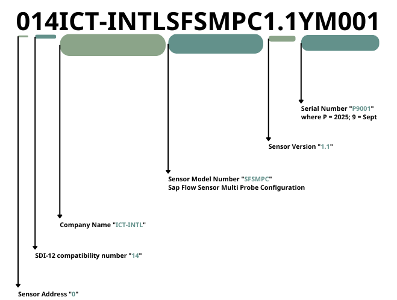
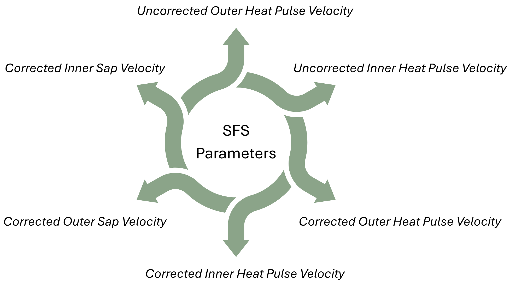
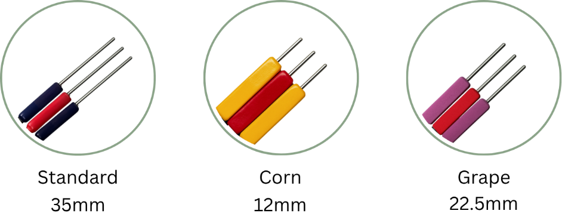
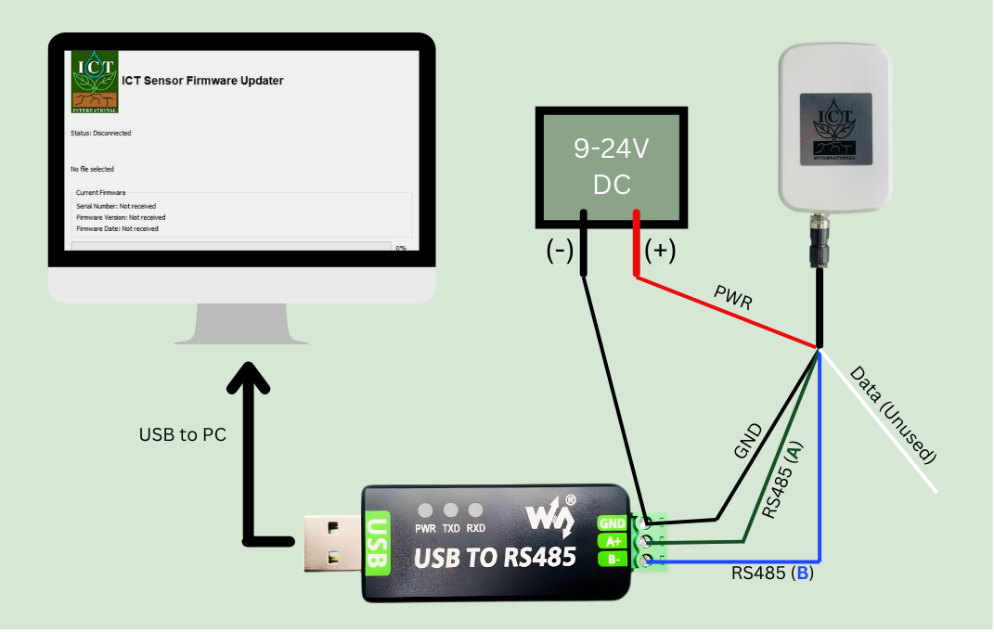
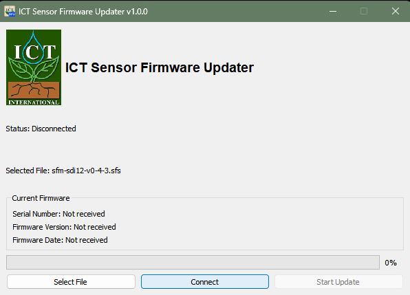
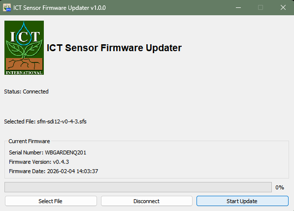
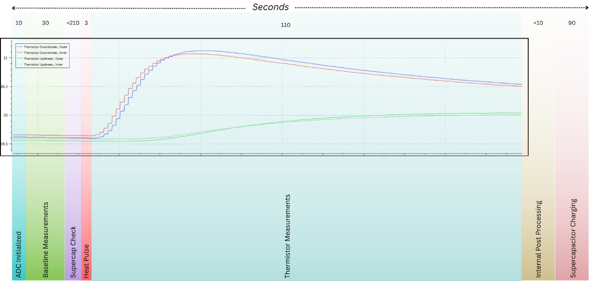
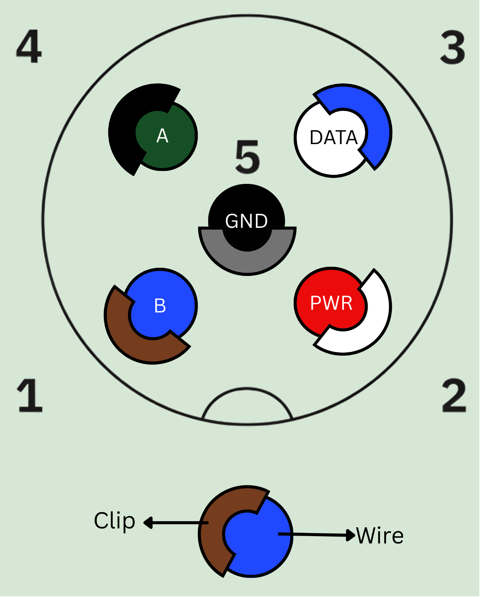
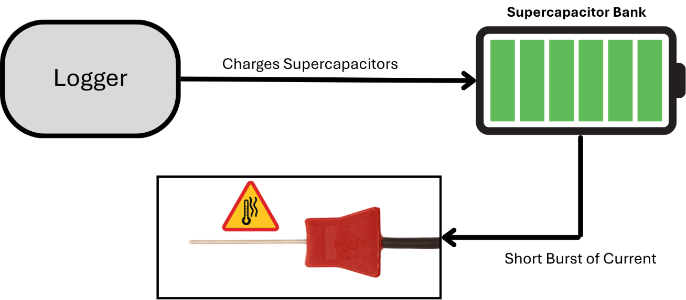
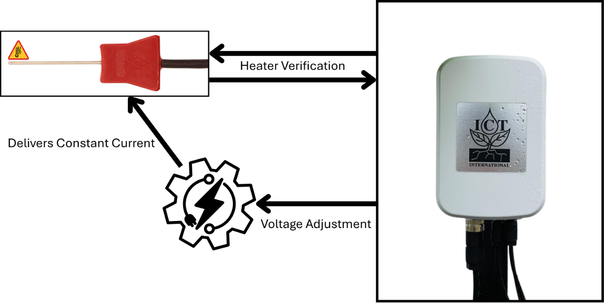

# Product Overview

## Introduction

The SFS Sap Flow Sensor precisely measures plant water use using Heat
Ratio Method (HRM). Providing calculated sap velocities, the sensor can
also provide raw needle temperature for post-processing.

Delivering six key metrics via SDI-12 v1.4, including sap flow rates and
velocities, with low power consumption, and a rugged multi-probe design,
it’s built for long-term field use in agriculture, forestry, and
ecology.

## Product Specification

| **Voltage Input**                | 9-24 V                        |
|----------------------------------|-------------------------------|
| **Maximum Current at 12V**       | 50 mA                         |
| **Power Consumption**            | 2.635 Wh/day                  |
| **Minimum Measurement Interval** | 10 minutes (*recommended*)    |
| **Communication Interface**      | SDI-12                        |
| **Measurement Accuracy**         | 0.5 cm/hr                     |
| **Measurement Resolution**       | 0.01 cm/hr                    |
| **Needle Options**               | 12 mm, 22.5 mm and 35 mm      |
| **Enclosure Dimensions**         | 150 x 100 x 75 mm (L x W x H) |

Table : SFS Power States

Figure : Product Specification

## Power States

| Power States | Current Drawn (at 12V) |
|--------------|------------------------|
| Charging     | 50 mA                  |
| Active       | ~ 4 mA                 |
| Sleeping     | ~ 2 mA                 |

Table : Wiring Guide

The Sap Flow Sensor (SFS) requires continuous power from the logger to
operate correctly. Configure the logger so that the sensor always
remains powered, even when the logger enters low‑power modes.

# What’s in the box

## Standard Inclusions

1\. Sensor Unit

2\. Probe Set

3\. Data Cable – 10m (standard)

## Options

1\. Extra Probe sets

2\. Test Blocks

3\. 1m probe extension cables

4\. 1m/ 10m/ 20m Data extension cable

# Operation and Measurement

## Electrical Wiring

| **Input/Output** | **Wire Colours** | **Comment**                     |
|------------------|------------------|---------------------------------|
| Power            | Red              | Voltage Range: **9-24V**        |
| Ground           | Black            |                                 |
| Data (SDI-12)    | White            |                                 |
| RS485 (A)        | Green            | Used for Firmware Upgrades Only |
| RS485 (B)        | Blue             |                                 |

Table : Product
Specifications

## Configurations

# SDI-12 Commands

## Basic Commands

## Extended Commands

## Example 1: Concurrent Measurement

## Example 2: Standard Measurement

## Example 3: High Volume Measurement

## Example 4: Multiple Sensor Configuration - When is the measurement made

# Maintenance and Support

## Serial Number Identification

## Firmware Upgrade

## Customer Repairs

## Diagnostic Commands

## Detailed Power Information

# Additional Information

## SFS Measurement Procedure: Standard HRM

## SFS Measurement Procedure: Raw Data

## Supercapacitor Bank

## Heater Power Management

###  Sensor to Logger Wiring configuration

Figure : Wiring
Configuration of SFS

| **Input/Output** | **Wire Colours** | **Comment**                     |
|------------------|------------------|---------------------------------|
| Power            | Red              | Voltage Range: **9-24V**        |
| Ground           | Black            |                                 |
| Data (SDI-12)    | White            |                                 |
| RS485 (A)        | Green            | Used for Firmware Upgrades Only |
| RS485 (B)        | Blue             |                                 |

Table : Basic SDI-12
Commands

### 1.2 Serial Number Identification

Figure : Serial Number
Identification

### 1.3 Product Specifications

| **Voltage Input**                | 9-24 V                        |
|----------------------------------|-------------------------------|
| **Maximum Current at 12V**       | 50 mA                         |
| **Power Consumption**            | 2.635 Wh/day                  |
| **Minimum Measurement Interval** | 10 minutes (*recommended*)    |
| **Communication Interface**      | SDI-12                        |
| **Measurement Accuracy**         | 0.5 cm/hr                     |
| **Measurement Resolution**       | 0.01 cm/hr                    |
| **Enclosure Dimensions**         | 150 x 100 x 75 mm (L x W x H) |

Table : Extended SDI-12
Commands

### 1.4 Sensor Parameters

Figure : Sensor
Parameters

### 1.5 Interchangeable Heater and Thermistor Probes

The heater and thermistor probes are designed to be removable so the
sensor can be used on different plant species. The probes may be swapped
while the sensor is powered off, and no software changes are required.
An internal hardware circuit automatically provides the correct heating
energy for the installed heater needle, and the firmware identifies
which heater is connected. In Heat Ratio Method (HRM) measurements, the
heater needle code is returned as the 7th value, and the thermistor
needle diagnostic is returned as the 8th value. For faster checks, the
heater can be identified using the Trigger Heat Pulse command, and the
thermistor can be checked using the Raw Thermistor Data command.

Figure : Needle Types

*Note: ICT International offers three standard needle sets. Customers
can request custom thermistor positions by printing the HRM Needle
Design.pdf and aligning it with the desired sapwood profile.*

## SDI-12 COMMANDS

### 2.1 Basic SDI-12 Commands

<table>
<caption>
Table :
Heater Diagnostics Code
</caption>
<colgroup>
<col style="width: 37%" />
<col style="width: 62%" />
</colgroup>
<thead>
<tr class="header">
<th>Command Name</th>
<th>Command</th>
</tr>
</thead>
<tbody>
<tr class="odd">
<td>Acknowledge Active</td>
<td>a!</td>
</tr>
<tr class="even">
<td>Send Identification</td>
<td>aI!</td>
</tr>
<tr class="odd">
<td>Change Address</td>
<td>aAb!</td>
</tr>
<tr class="even">
<td>Address Query</td>
<td>?!</td>
</tr>
<tr class="odd">
<td>Send Data</td>
<td>
aD0! (uncorrected outer and inner HPV)

aD1! (corrected outer and inner HPV)

aD2! (corrected outer and inner SapV)

aD3! (Heater and Thermistor Verification Code) 
aD4! (Temperature Diagnostics)
</td>
</tr>
<tr class="even">
<td rowspan="2">Start Measurement</td>
<td>
aM! (Measurement Command)

383 seconds
</td>
</tr>
<tr class="odd">
<td>
aC! (Concurrent Command)

156 seconds
</td>
</tr>
<tr class="even">
<td>Baseline Temperature</td>
<td>
aC1!

30 seconds average
</td>
</tr>
<tr class="odd">
<td>Trigger Heat Pulse</td>
<td>
aC2!

10 seconds
</td>
</tr>
<tr class="even">
<td>Raw Thermistor Data</td>
<td>
aC3!

10 seconds
</td>
</tr>
<tr class="odd">
<td>Supercapacitor Voltage</td>
<td>aC4!</td>
</tr>
<tr class="even">
<td>Heater Voltage</td>
<td>aC5!</td>
</tr>
<tr class="odd">
<td>Board Temperature</td>
<td>aC7!</td>
</tr>
</tbody>
</table>

Table : Heater
Diagnostics Code

### 2.2 Extended SDI-12 Commands

<table>
<caption>
Table :
Thermistor Diagnostics Codes
</caption>
<colgroup>
<col style="width: 32%" />
<col style="width: 67%" />
</colgroup>
<thead>
<tr class="header">
<th>Command Name</th>
<th>Command</th>
</tr>
</thead>
<tbody>
<tr class="odd">
<td>Verification Command</td>
<td>aV!</td>
</tr>
<tr class="even">
<td>High Volume Command</td>
<td>
aHA!

143 seconds

• 10s ADC initialisation

• 3s heat pulse

• 130s MHRM heat pulse logging and calculation
</td>
</tr>
<tr class="odd">
<td>Configure Thermal Diffusivity</td>
<td>aXTD=&lt;value&gt;*!</td>
</tr>
<tr class="even">
<td>Configure Heater-to-measurement probe distance</td>
<td>aXHD=&lt;value&gt;!</td>
</tr>
<tr class="odd">
<td>Configure Baseline Asymmetry Offset</td>
<td>aXBO=&lt;value&gt;!</td>
</tr>
<tr class="even">
<td>Configure Wound Diameter</td>
<td>aXWD=&lt;value&gt;!</td>
</tr>
<tr class="odd">
<td>Configure VS (i.e. Sap Velocity) Factor</td>
<td>aXVS=&lt;value&gt;!</td>
</tr>
</tbody>
</table>

Table : Thermistor
Diagnostics Codes

### 2.3 Heater Diagnostics Codes

| **Value** | **Shorthand**            | **Meaning**                                                              |
|-----------|--------------------------|--------------------------------------------------------------------------|
| -2        | Heater Needle Determined | This is the default code for a sensor that has not yet run a heat pulse. |
| -1        | Determination Error      | Caused by an inability to detect a stable heat pulse.                    |
| 0         | Needle Short Error       | A possible short has occurred or needle resistance is very low.          |
| 1         | 35mm Heater Detected     | The 18 ohm, 35mm heater needle has been detected.                        |
| 2         | 12mm Heater Detected     | The 8 ohm, 12 mm heater needle has been detected.                        |
| 3         | 22.5mm Heater Detected   | The 13 ohm 25.3mm heater needle has been detected.                       |
| 4         | Open Circuit Error       | Likely no needle attached / poor connection made. Reconnect needle.      |

Table : Temperature Rise
Diagnostics Codes

### 2.4 Thermistor Diagnostics Codes

| **Value** | **Meaning**                                                                 | **Suggested Action**                                                                      |
|-----------|-----------------------------------------------------------------------------|-------------------------------------------------------------------------------------------|
| -1        | Thermistors undetermined                                                    | This is the default code for a sensor that has not yet run measurement that uses the ADC. |
| 0         | All Thermistors valid                                                       | None                                                                                      |
| 1         | Downstream probe partially disconnected or broken.                          | Reconnect the downstream thermistor probe.                                                |
| 2         | Downstream probe partially disconnected or broken.                          | Reconnect the downstream thermistor probe.                                                |
| 3         | Downstream probe fully disconnected or broken.                              | Reconnect the downstream thermistor probe.                                                |
| 4         | Upstream probe partially disconnected or broken.                            | Reconnect the upstream thermistor probe.                                                  |
| 5         | Upstream and downstream probes partially disconnected or broken.            | Reconnect both thermistor probes.                                                         |
| 6         | Upstream and downstream probes partially disconnected or broken.            | Reconnect both thermistor probes.                                                         |
| 7         | Downstream probe fully and upstream probe partially disconnected or broken. | Reconnect both thermistor probes.                                                         |
| 8         | Upstream probe partially disconnected or broken.                            | Reconnect the upstream thermistor probe.                                                  |
| 9         | Upstream and downstream probes partially disconnected or broken.            | Reconnect both thermistor probes.                                                         |
| 10        | Upstream and downstream probes partially disconnected or broken.            | Reconnect both thermistor probes.                                                         |
| 11        | Downstream probe fully and upstream probe partially disconnected or broken. | Reconnect both thermistor probes.                                                         |
| 12        | Upstream probe fully disconnected or broken.                                | Reconnect the upstream thermistor probe.                                                  |
| 13        | Upstream probe fully and downstream probe partially disconnected or broken. | Reconnect both thermistor probes.                                                         |
| 14        | Upstream probe fully and downstream probe partially disconnected or broken. | Reconnect both thermistor probes.                                                         |
| 15        | Upstream and downstream probes fully disconnected or broken.                | Reconnect both thermistor probes.                                                         |

Table : SFS Power States

### 2.5 Temperature Rise Diagnostics Codes

| **Value** | **Meaning**                       |
|-----------|-----------------------------------|
| 0         | Temperature Rise OK               |
| 1         | TDIN ERROR                        |
| 2         | TDOUT ERROR                       |
| 3         | TDIN + TDOUT ERROR                |
| 4         | TUIN ERROR                        |
| 5         | TUIN +TDIN ERROR                  |
| 6         | TUIN + TUOUT ERROR                |
| 7         | TUIN + TDIN + TDOUT ERROR         |
| 8         | TUOUT ERROR                       |
| 9         | TUOUT + TDIN ERROR                |
| 10        | TUOUT + TDOUT ERROR               |
| 11        | TUOUT + TDIN + TDOUT ERROR        |
| 12        | TUOUT + TUIN ERROR                |
| 13        | TUOUT + TUIN + TDIN ERROR         |
| 14        | TUOUT + TUIN + TDOUT ERROR        |
| 15        | TUOUT + TUIN + TDIN + TDOUT ERROR |

Table : SFS States

*  
*

## POWER

### 3.1 SFS Power States

| Power States | Current Drawn (at 12V) |
|--------------|------------------------|
| Charging     | 50 mA                  |
| Active       | ~ 4 mA                 |
| Sleeping     | ~ 2 mA                 |

Table : SFS Power
Consumption at 12V input

> The Sap Flow Sensor (SFS) requires continuous power from the logger to
> operate correctly. Configure the logger so that the sensor always
> remains powered, even when the logger enters low‑power modes.

<table>
<caption>
Table : SFS
Current Draw at different input voltages
</caption>
<colgroup>
<col style="width: 16%" />
<col style="width: 83%" />
</colgroup>
<thead>
<tr class="header">
<th><strong>SFS States</strong></th>
<th>
<strong>Description</strong>

<em><strong>(10-minute Measurement Cycle)</strong></em>
</th>
</tr>
</thead>
<tbody>
<tr class="odd">
<td>Active</td>
<td>
<em>ADC Initialization &amp; Baseline Temperature Measurements
(1–42 seconds)</em>

The sensor powers up its ADC, stabilizes internal electronics, and
records baseline temperature values used for HRM calculations.
</td>
</tr>
<tr class="even">
<td>Charging</td>
<td>
<em>Supercapacitor Check &amp; Top‑Up (43–45 seconds)</em>

The system checks the supercapacitor voltage and adds a small top‑up
charge if required. This ensures the capacitor has enough stored energy
for the upcoming measurement phase.
</td>
</tr>
<tr class="odd">
<td>Active</td>
<td>
<em>Measurement, Processing &amp; HRM Calculation (46–156
seconds)</em>

The sensor performs the full Heat Ratio Method measurement, processes
raw thermal data, and calculates sap flow outputs. This is the
highest‑power phase of the cycle.
</td>
</tr>
<tr class="even">
<td>Charging</td>
<td>
<em>Supercapacitor Charging Cycle (157–236 seconds)</em>

The supercapacitor is fully recharged from the SDI‑12 supply. This
prepares the sensor for the next measurement cycle and prevents SDI‑12
current overload.
</td>
</tr>
<tr class="odd">
<td>Sleeping</td>
<td>
<em>Sleep (237–600 seconds)</em>

The sensor enters deep sleep, drawing minimal current. Only essential
circuitry remains active until the next cycle begins.
</td>
</tr>
</tbody>
</table>

Table : SFS Current Draw
at different input voltages

Figure : SFS Power Cycle
Graph

### 3.2 SFS Power Consumption

<table>
<caption>
Table : SFS
Power Draw for high volume command
</caption>
<colgroup>
<col style="width: 15%" />
<col style="width: 12%" />
<col style="width: 22%" />
<col style="width: 12%" />
<col style="width: 22%" />
<col style="width: 14%" />
</colgroup>
<thead>
<tr class="header">
<th>
<strong>Power</strong>

<strong>States</strong>
</th>
<th>Active</th>
<th>
Supercapacitor

Check
</th>
<th>Active</th>
<th>
Supercapacitor

Charging
</th>
<th>Sleep</th>
</tr>
</thead>
<tbody>
<tr class="odd">
<td><strong>Time (s)</strong></td>
<td>1-42</td>
<td>43-45</td>
<td>46-156</td>
<td>157-236</td>
<td>237-600</td>
</tr>
<tr class="even">
<td>Q1</td>
<td>0.0467</td>
<td></td>
<td></td>
<td></td>
<td></td>
</tr>
<tr class="odd">
<td>Q2</td>
<td></td>
<td>0.0417</td>
<td></td>
<td></td>
<td></td>
</tr>
<tr class="even">
<td>Q3</td>
<td></td>
<td></td>
<td>0.1233</td>
<td></td>
<td></td>
</tr>
<tr class="odd">
<td>Q4</td>
<td></td>
<td></td>
<td></td>
<td>1.1111</td>
<td></td>
</tr>
<tr class="even">
<td>Q5</td>
<td></td>
<td></td>
<td></td>
<td></td>
<td>0.2022</td>
</tr>
<tr class="odd">
<td><strong>QT</strong></td>
<td colspan="5">1.525 mAh for a 10-minute cycle at 12V</td>
</tr>
<tr class="even">
<td>
<strong>Power</strong>

<strong>(Wh/day)</strong>
</td>
<td colspan="5">2.635 Wh/day for a 10-minute cycle at 12V</td>
</tr>
</tbody>
</table>

Table : SFS Power Draw
for high volume command

The current draw of the sensor differs depending on the input voltage
and device state. Empirically measured data on a SFS gave the following
results:

| **Input (V)** | **Current when charging supercapacitors (mA)** | **Current when sensor idle (mA)** | **Current when sensor asleep (mA)** |
|---------------|------------------------------------------------|-----------------------------------|-------------------------------------|
| 9             | 67.5                                           | 3.66                              | 1.84                                |
| 12            | 50                                             | 2.96                              | 1.57                                |
| 15            | 41                                             | 2.57                              | 1.40                                |
| 18            | 35                                             | 2.30                              | 1.30                                |
| 21            | 31                                             | 2.11                              | 1.22                                |
| 24            | 28                                             | 1.96                              | 1.15                                |

Table : SFS Power Modes

With a 15-minute measurement interval, using a high-volume measurement
command, power consumption can be deduced for a 24hr duration.

| **Input (V)** | **Charging power per measurement (Wh)** | **Active power per measurement (Wh)** | **Sleep power per measurement (Wh)** | **Power per day (Wh)** |
|---------------|-----------------------------------------|---------------------------------------|--------------------------------------|------------------------|
| 9             | 0.0206                                  | 0.0014                                | 0.0029                               | 2.39                   |
| 12            | 0.0203                                  | 0.0015                                | 0.0033                               | 2.41                   |
| 15            | 0.0208                                  | 0.0016                                | 0.0036                               | 2.51                   |
| 18            | 0.0214                                  | 0.0018                                | 0.0041                               | 2.61                   |
| 21            | 0.0221                                  | 0.0019                                | 0.0044                               | 2.73                   |
| 24            | 0.0228                                  | 0.0020                                | 0.0048                               | 2.84                   |

*  
*

## FIRMWARE UPGRADE

### 4.1 Firmware Upgrade over RS485

Figure : SFS Firmware
Update Process

For the SFS firmware update process the following tools are required:

1.  Industrial USB to RS485 Converter -
    <https://www.waveshare.com/product/usb-to-rs485.htm>

2.  DC Power Source 9-24V Rated

3.  ICT Sensor Firmware Updater v1.1.0 – provided by ICT International

4.  Latest Sap Flow Sensor Firmware (.sfs) file – provided by ICT
    International

> After wiring the sensor as shown in Figure 5.1, launch the ICT Sensor
> Firmware Updater on a Windows PC running Windows 10 or later.

1.  Click the “Select File” button on the software and open the latest
    firmware .sfs file from file explorer

>  style="width:4.31429in;height:3.07042in" />

Figure : Select the
firmware file

2.  Click the “Connect” button on the software

>  style="width:4.47826in;height:3.22252in" />

Figure : Connect the
sensor

3.  Once connected the Current Firmware section of the software will
    populate with the current firmware version of the sensor, click
    “Start Update”

>  style="width:4.76087in;height:3.41747in" />

Figure : Start Update
process

4.  Once the “Status” of the software changes to “Done”, click
    “Disconnect”

>  style="width:4.66304in;height:3.34401in" />

Figure : Disconnect the
sensor from the software

5.  Switch off the power supply before unplugging the sensor

## Appendix A

### SFS Measurement Procedure: Standard HRM

Figure : Standard HRM Measurement

Note, a Concurrent HRM command variant (e.g. aC!) will abort if it
exceeds 156 seconds. Hence the supercapacitors must be fully charged
before initiating the command. A Standard HRM command variant (e.g. aM!)
is 383 seconds to ensure that even a fully depleted supercapacitor bank
will charge before a measurement, and the measurement will complete.

### SFS Measurement Procedure: Raw Data 

Figure : Raw Data

Note, a High Volume raw data (aHA!) command will abort if it exceeds 143
seconds. Hence the supercapacitors must be fully charged before
initiating the command.

*  
*

### SFS Power Modes: Notes 

| **Power Modes**          | **Important Notes**                                                                                                                                                                                                                                                                                                                                                                                                                                                                                                                                                                                                                                                                                                                |
|--------------------------|------------------------------------------------------------------------------------------------------------------------------------------------------------------------------------------------------------------------------------------------------------------------------------------------------------------------------------------------------------------------------------------------------------------------------------------------------------------------------------------------------------------------------------------------------------------------------------------------------------------------------------------------------------------------------------------------------------------------------------|
| Sleep                    | Bus must be powered                                                                                                                                                                                                                                                                                                                                                                                                                                                                                                                                                                                                                                                                                                                |
|                          | Occurs when no measurements are active                                                                                                                                                                                                                                                                                                                                                                                                                                                                                                                                                                                                                                                                                             |
| Active                   | While measurement is active and supercapacitors are not changing                                                                                                                                                                                                                                                                                                                                                                                                                                                                                                                                                                                                                                                                   |
| Charging Supercapacitors | Before HRM during 'M' command                                                                                                                                                                                                                                                                                                                                                                                                                                                                                                                                                                                                                                                                                                      |
|                          | During a HRM measurement ('C', 'M' or 'HA'), just after a baseline measurement and before a heat pulse there is a "top up" charge that will last until the supercapacitors have adequate charge for a heat pulse. Note, with a standard interval of 15 minutes between concurrent commands, this will be ~3 seconds. If the interval since the last concurrent command is larger, the bus has only just been powered or if the bus is not powered between measurements, this "top up" charge will be longer and as such, concurrent commands should not be used without script management of power. For simplicity, 'M' commands can be used to ensure that the bus is powered for an adequate time to charge the supercapacitors. |
|                          | Following a HRM measurement ('C', 'M' or 'HA')                                                                                                                                                                                                                                                                                                                                                                                                                                                                                                                                                                                                                                                                                     |

## Appendix C

### Enclosure Connector Layout

Figure : SFS Connector
Layout

This diagram shows where each cable connects on the Sap Flow Sensor
(SFS). The Data port on the left sends measurements out to the logger,
while the three ports on the right are inputs from the probe: Heater
(middle connector) powers the constant current heater, and Upstream and
Downstream (top and bottom connectors) connect to the two thermistor
probes inserted above and below the heater.

### Cable Connector Wiring

Figure : SFS Cable Connector
Wiring

### 1.6 Supercapacitor Bank

The supercapacitor bank is used to store energy for heat pulses. The
supercapacitors allow up to 6x SFS devices to be supported on the SDI-12
bus without special power considerations i.e. no need for complicated
software management of power or breaking of protocol power standards.
The supercapacitors nominally charge to 4.8V. They can be diagnosed with
a Supercapacitor Voltage command.

Figure : Needle Types

### 1.7 Traditional Sap Flow Meters (SFM1 and SFM1x)

> In traditional SFM and early SFM1x sensors, the heater always receives
> a fixed 12 V supply. Because voltage is constant, the current depends
> entirely on the heater’s resistance (Ohm’s Law).

- Standard heater (18 Ω): 0.67 A

- Corn heater (8 Ω): 1.5 A

- Vine heater (13 Ω): 0.92 A

> This means the corn heater draws 2.2 times, and the vine heater 1.4
> times, the current of the standard heater.
>
> Since Power = Voltage × Current, smaller‑resistance heaters generate
> much more heat per millimetre of needle length:

- Standard: 0.23 W/mm

- Corn: 1.50 W/mm

- Vine: 0.49 W/mm

> As needle size decreases, power per millimetre increases sharply,
> which can overheat and damage plant tissue. Hence, only standard 35mm
> heater is suitable for those instruments.

### 1.8 Constant Current Circuit Advantage

> In the updated design for SFS, all heater types are driven with a
> constant current of 0.67 A. The voltage automatically adjusts based on
> heater resistance:

- Standard (18 Ω): 12.06 V

- Corn (8 Ω): 5.36 V

- Vine (13 Ω): 8.71 V

> This results in much more consistent power per millimetre across all
> heater types:

- Standard: 0.231 W/mm

- Corn: 0.299 W/mm

- Vine: 0.259 W/mm

> Because all heaters share the same needle body, heat is also
> dissipated through the plastic housing, making the actual power/mm
> even more uniform.

Figure : Heater Power
Management

## Appendix D

### Record of Changes

| **Document Title** | ICT International Pty. Ltd. Sap Flow Sensor Manual |
|--------------------|----------------------------------------------------|
| **Document No.**   | 6593-01-01-M-R1-2                                  |

| **Pages** | **Description of Changes Made** | **Issued Version** | **Change Date** | **Signed**    |
|-----------|---------------------------------|--------------------|-----------------|---------------|
| ALL       | Initial Release                 | 1.0                | 23/03/2026      | Rahinul Hoque |
|           |                                 |                    |                 |               |
|           |                                 |                    |                 |               |
|           |                                 |                    |                 |               |
|           |                                 |                    |                 |               |
|           |                                 |                    |                 |               |
|           |                                 |                    |                 |               |
|           |                                 |                    |                 |               |
|           |                                 |                    |                 |               |
|           |                                 |                    |                 |               |
|           |                                 |                    |                 |               |
|           |                                 |                    |                 |               |
|           |                                 |                    |                 |               |
|           |                                 |                    |                 |               |
|           |                                 |                    |                 |               |
|           |                                 |                    |                 |               |
|           |                                 |                    |                 |               |
|           |                                 |                    |                 |               |
|           |                                 |                    |                 |               |
|           |                                 |                    |                 |               |
|           |                                 |                    |                 |               |
|           |                                 |                    |                 |               |
|           |                                 |                    |                 |               |
|           |                                 |                    |                 |               |
|           |                                 |                    |                 |               |
|           |                                 |                    |                 |               |
|           |                                 |                    |                 |               |
|           |                                 |                    |                 |               |
|           |                                 |                    |                 |               |
|           |                                 |                    |                 |               |
|           |                                 |                    |                 |               |
|           |                                 |                    |                 |               |
|           |                                 |                    |                 |               |
|           |                                 |                    |                 |               |
|           |                                 |                    |                 |               |
|           |                                 |                    |                 |               |
|           |                                 |                    |                 |               |
