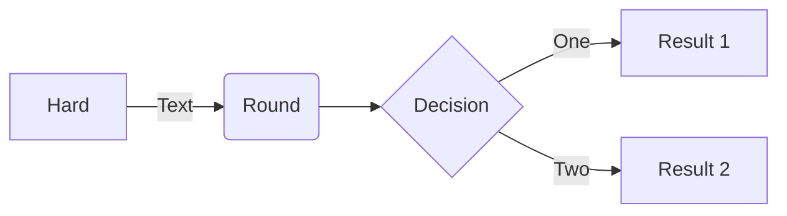

# MFR Node

This is a test file created to check if the system (render, build and injection) works for the added content.

## The Cauchy-Schwarz Inequality

$$\left( \sum_{k=1}^n a_k b_k \right)^2 \leq \left( \sum_{k=1}^n a_k^2 \right) \left( \sum_{k=1}^n b_k^2 \right)$$

# [Linux](#tab/linux)

Content for Linux...

# [Windows](#tab/windows)

Content for Windows...

---

# [.NET](#tab/dotnet/linux)

.NET content for Linux...

# [.NET](#tab/dotnet/windows)

.NET content for Windows...

# [TypeScript](#tab/typescript/linux)

TypeScript content for Linux...

# [TypeScript](#tab/typescript/windows)

TypeScript content for Windows...

# [REST API](#tab/rest)

REST API content, independent of platform...

---
