# CE Certification

This product is certified in accordance with the CE and UKCA
requirements. A copy of the Declaration of Conformity can be downloaded
from [ictinternational.com/ce](https://ictinternational.com/ce)

# Product Overview

## Introduction

The SFS Sap Flow Sensor precisely measures plant water use using Heat
Ratio Method (HRM). Providing calculated sap velocities, the sensor can
also provide raw needle temperature for post-processing.

Delivering six key metrics via SDI-12 v1.4, including sap flow rates and
velocities, with low power consumption, and a rugged multi-probe design,
it’s built for long-term field use in agriculture, forestry, and
ecology.

## Product Specification

| **Voltage Input**                | 9-24 V                        |
|----------------------------------|-------------------------------|
| **Maximum Current at 12V**       | 50 mA                         |
| **Power Consumption**            | 2.635 Wh/day                  |
| **Minimum Measurement Interval** | 10 minutes (*recommended*)    |
| **Communication Interface**      | SDI-12                        |
| **Measurement Accuracy**         | 0.5 cm/hr                     |
| **Measurement Resolution**       | 0.01 cm/hr                    |
| **Needle Options**               | 12 mm, 22.5 mm and 35 mm      |
| **Enclosure Dimensions**         | 150 x 100 x 75 mm (L x W x H) |

Table 1: SFS Power States

Figure 1: Product Specification

## Power States

| Power States | Current Drawn (at 12V) |
|--------------|------------------------|
| Charging     | 50 mA                  |
| Active       | ~ 4 mA                 |
| Sleeping     | ~ 2 mA                 |

Table 2: Standard Inclusions

The Sap Flow Sensor (SFS) requires continuous power from the logger to
operate correctly. Configure the logger so that the sensor always
remains powered, even when the logger enters low‑power modes.

# What’s in the box

## Standard Inclusions

<table>
  <tr>
    <th>Inclusions</th>
    <th colspan="3">Sensor Model</th>
  </tr>
  <tr>
    <th></th>
    <th><em>SFS-12</em></th>
    <th><em>SFS-22.5</em></th>
    <th><em>SFS-35</em></th>
  </tr>

  <tr>
    <td><strong>Probe Set</strong></td>
    <td align="center">
      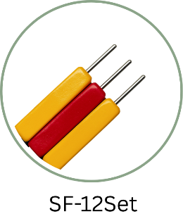 
      SF-12Set
    </td>
    <td align="center">
      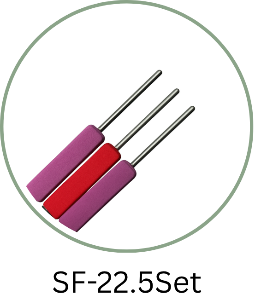 
      SF-22.5Set
    </td>
    <td align="center">
      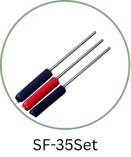 
      SF-35Set
    </td>
  </tr>

  <tr>
    <td><strong>Sensor Unit</strong></td>
    <td colspan="3" align="center">
      
    </td>
  </tr>

  <tr>
    <td><strong>Sensor Cable</strong></td>
    <td colspan="3" align="center">10 m (<em>standard</em>)</td>
  </tr>
</table>

Table 3: SFS Electrical Specification

## Options

1.  Extra Probe Sets – *SF12Set/ SF22.5Set/ SF35Set*

2.  Test Block – *SF-TB*

3.  Probe Extension Cables – *1m*

4.  Sensor Extension Cables – *1m/ 10m/ 20m*

# Operation and Measurement

## Electrical Wiring

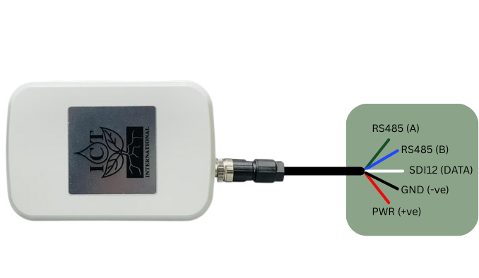

Figure 2: SFS Wiring Configuration

<table>
<caption>
Table 4: Program Support
</caption>
<colgroup>
<col style="width: 37%" />
<col style="width: 31%" />
<col style="width: 31%" />
</colgroup>
<thead>
<tr class="header">
<th><strong>Input/Output</strong></th>
<th><strong>Wire Colours</strong></th>
<th><strong>Comment</strong></th>
</tr>
</thead>
<tbody>
<tr class="odd">
<td>Power</td>
<td>Red</td>
<td>Voltage Range: <strong>9-24V</strong></td>
</tr>
<tr class="even">
<td>Ground</td>
<td>Black</td>
<td></td>
</tr>
<tr class="odd">
<td>Data (SDI-12)</td>
<td>White</td>
<td></td>
</tr>
<tr class="even">
<td>RS485 (A)</td>
<td>Green</td>
<td rowspan="2">
Firmware Upgrades

Use Only
</td>
</tr>
<tr class="odd">
<td>RS485 (B)</td>
<td>Blue</td>
</tr>
</tbody>
</table>

Table 4: Program Support

## Getting started

- Connect the sap‑flow sensor to any SDI‑12 v1.4‑compatible data logger
  using the wiring in Figure 2.

- Send the address query *?!* to confirm the sensor is responding.

- Then request its identification string *aI!* to verify the sensor’s
  model and serial number.

Once communication is confirmed, you can prepare the required SDI‑12
program or script before installing the system in the field.

For guidance on writing logger programs and integrating the sensor with
different platforms, please refer to the following documents:

| **Documentation**         | **Description**                                                                                          |
|---------------------------|----------------------------------------------------------------------------------------------------------|
| Campbell Logger Guide     | Instructions for configuring and programming Campbell Scientific data loggers for SDI‑12 sensors.        |
| Halytech Logger Guide     | Setup and scripting guidance for using the sensor with Halytech loggers.                                 |
| Campbell Scripts (GitHub) | Example SDI‑12 scripts and templates for Campbell loggers, available in the project’s GitHub repository. |

Table 5: Test Example

ICT International recommends bench testing the unit before installation.

### Sensor Test

Place the probes in the optional test block to keep them steady. After
the logger powers the sensor, open the logger’s terminal so you can send
SDI‑12 commands. Run a manual measurement, wait for the sensor to signal
that the reading is ready, and then retrieve the values. If the numbers
look correctly formatted, stable, and sensible, the sensor is wired
properly and ready for installation.

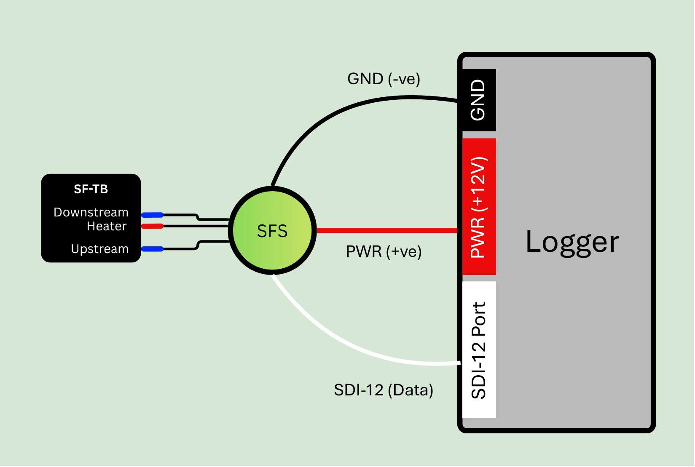

Figure 3: SFS Test Setup

| ***Logger*** | ***Example SFS Response***  | ***Description***                                   |
|--------------|-----------------------------|-----------------------------------------------------|
| *?!*         | *0*                         | *Sensor Returns Address = 0*                        |
| *0I!*        | *014ICT-INTLSFSMPC1.2Q1001* | *Sensor Information*                                |
| *0C!*        | *015609*                    | *Logger must wait 156 seconds to get 9 results*     |
| *0D0!*       | *0+10.677+10.543*           | *Uncorrected Outer and Inner Heat Pulse Velocities* |
| *0D1!*       | *0+19.345+19.123*           | *Corrected Outer and Inner Heat Pulse Velocities*   |
| *0D2!*       | *0+13.456+13.221*           | *Corrected Sap Flow Velocities*                     |
| *0D3!*       | *0+03.000+00.000*           | *Needle Verification codes (section 5.4)*           |
| *0D4!*       | *0+00.000*                  | *Temperature Diagnostics (section 5.4)*             |

Table 6: Basic SDI-12 Commands

# SDI-12 Commands

## Basic Commands

<table>
<caption>
Table 7: Extended SDI12 Commands
</caption>
<colgroup>
<col style="width: 28%" />
<col style="width: 29%" />
<col style="width: 41%" />
</colgroup>
<thead>
<tr class="header">
<th>Command Name</th>
<th>Command</th>
<th>Description</th>
</tr>
</thead>
<tbody>
<tr class="odd">
<td>Acknowledge Active</td>
<td>a!</td>
<td>Sensor active check</td>
</tr>
<tr class="even">
<td>Send Identification</td>
<td>aI!</td>
<td>Send identification information</td>
</tr>
<tr class="odd">
<td>Address Query</td>
<td>?!</td>
<td>Used when the address is unknown to have the sensor identify its
address</td>
</tr>
<tr class="even">
<td>Change Address</td>
<td>aAb!</td>
<td>Changes the address of the sensor from a to b</td>
</tr>
<tr class="odd">
<td rowspan="2">Start Measurement</td>
<td>
aM!

(Measurement Command)

<em>383 seconds</em>
</td>
<td>Tells the sensor to take a measurement</td>
</tr>
<tr class="even">
<td>
aC!

(Concurrent Command)

<em>156 seconds</em>
</td>
<td>Used to take a measurement when more than one sensor is used on the
same data line</td>
</tr>
<tr class="odd">
<td rowspan="5">Send Data</td>
<td>
aD0!

(uncorrected outer and inner HPV)
</td>
<td rowspan="5">Retrieves the data from a sensor</td>
</tr>
<tr class="even">
<td>
aD1!

(corrected outer and inner HPV)
</td>
</tr>
<tr class="odd">
<td>
aD2!

(corrected outer and inner Sap Velocity)
</td>
</tr>
<tr class="even">
<td>
aD3!

(Heater and Thermistor Verification Code)
</td>
</tr>
<tr class="odd">
<td>
aD4!

(Temperature Diagnostics)
</td>
</tr>
<tr class="even">
<td>Baseline Temperature</td>
<td>
aC1!

<em>30 seconds average</em>
</td>
<td>Performs Baseline Temperature Measurement</td>
</tr>
<tr class="odd">
<td>Trigger Heat Pulse</td>
<td>
aC2!

<em>10 seconds</em>
</td>
<td>Performs a heat pulse</td>
</tr>
<tr class="even">
<td>Raw Thermistor Data</td>
<td>
aC3!

<em>10 seconds</em>
</td>
<td>Performs Raw Thermistor Data Measurement</td>
</tr>
<tr class="odd">
<td>Supercapacitor Voltage</td>
<td>aC4!</td>
<td>Performs Supercapacitor Voltage Check</td>
</tr>
<tr class="even">
<td>Heater Voltage</td>
<td>aC5!</td>
<td>Performs Heater Voltage Check</td>
</tr>
<tr class="odd">
<td>Board Temperature</td>
<td>aC7!</td>
<td>Performs Board Temperature Check</td>
</tr>
</tbody>
</table>

Table 7: Extended SDI12 Commands

## Extended Commands

<table>
<caption>
Table 8:
Wiring Guide
</caption>
<colgroup>
<col style="width: 28%" />
<col style="width: 38%" />
<col style="width: 33%" />
</colgroup>
<thead>
<tr class="header">
<th>Command Name</th>
<th>Command</th>
<th>Description</th>
</tr>
</thead>
<tbody>
<tr class="odd">
<td>Verification Command</td>
<td>aV!</td>
<td>Checks heater, thermistor and temperature rise diagnostics</td>
</tr>
<tr class="even">
<td>High Volume Command</td>
<td>
aHA!

143 seconds

• 10s ADC initialisation

• 3s heat pulse

• 130s MHRM heat pulse logging and calculation
</td>
<td>Sensor takes measurement and returns raw thermistor readings that
followed the heat pulse. The total measurement time is 143 seconds</td>
</tr>
<tr class="odd">
<td>Configure Thermal Diffusivity</td>
<td>aXTD=&lt;value&gt;*!</td>
<td>Change the thermal diffusivity. By default, it is set to 0.0025
cm/s</td>
</tr>
<tr class="even">
<td>Configure Heater-to-measurement probe distance</td>
<td>aXHD=&lt;value&gt;!</td>
<td>Change the heater-to-measurement probe distance. By default, it is
set to 0.5 cm</td>
</tr>
<tr class="odd">
<td>Configure Baseline Asymmetry Offset</td>
<td>aXBO=&lt;value&gt;!</td>
<td>Change the Baseline Asymmetry Offset. By default, it is set to 0
cm/hr</td>
</tr>
<tr class="even">
<td>Configure Wound Diameter</td>
<td>aXWD=&lt;value&gt;!</td>
<td>Change the Wound Diameter. By default, it is set to 0.20 cm</td>
</tr>
<tr class="odd">
<td>Configure VS (i.e. Sap Velocity) Factor</td>
<td>aXVS=&lt;value&gt;!</td>
<td>Change the VS Factor. By default it is set to 0.64347</td>
</tr>
</tbody>
</table>

Table 8: Wiring Guide

## Example 1: Concurrent Measurement

When using multiple SFS sensors on a logger’s SDI‑12 port, start by
connecting each sensor one at a time and assigning it a unique address
(by default each SFS will have addresses set to “0”). Set up the program
in the logger so it sends the *aC!* command to each sensor in sequence.
Include a 156‑second delay to allow all measurements to finish. After
that, poll each sensor using the *aD0!*, *aD1!*, and *aD2!* commands.
Once the data is returned, save it to the logger’s internal memory or an
external memory card.

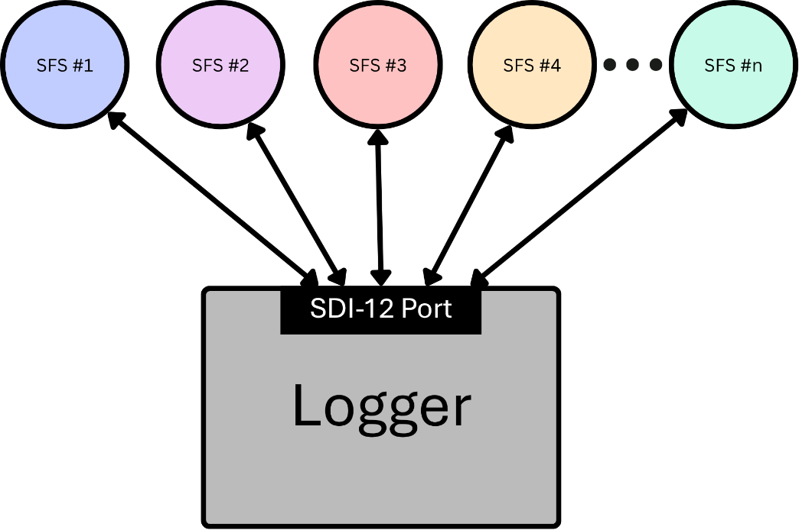

Figure 4: Concurrent Example

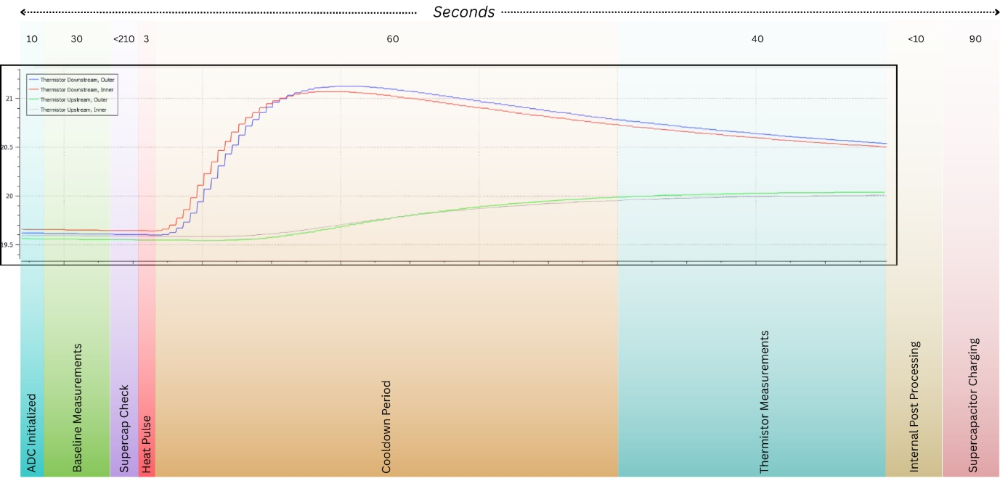

Figure 5: HRM Measurement Cycle

Note, a Concurrent HRM command variant (e.g. aC!) will abort if it
exceeds 156 seconds. Hence the supercapacitors must be fully charged
before initiating the command. A Standard HRM command variant (e.g. aM!)
is 383 seconds to ensure that even a fully depleted supercapacitor bank
will charge before a measurement, and the measurement will complete.

## Example 2: Standard Measurement

When using multiple SFS sensors on a single SDI‑12 port, begin by
connecting each sensor individually and assigning it a unique address,
since all SFS units are shipped with the default address 0. After
addressing, the logger must trigger each sensor one at a time using the
standard *aM!* measurement command. SDI‑12 does not allow multiple
sensors to run M! measurements concurrently on the same bus, so each
sensor must complete its full measurement cycle before the next one is
started.

An SFS requires up to 383 seconds to complete a measurement command,
including the time needed to recharge its supercapacitor bank. Because
each sensor must finish before the next can begin, the total measurement
time increases with every additional sensor. For example, six sensors
would require more than 38 minutes to complete a full sequence, which
makes this approach unsuitable for applications with tight timing
requirements or frequent sampling intervals.

After each sensor completes its measurement, the logger can retrieve the
results using *aD0!*, *aD1!*, and *aD2!*, and then store the returned
values in internal or external memory.

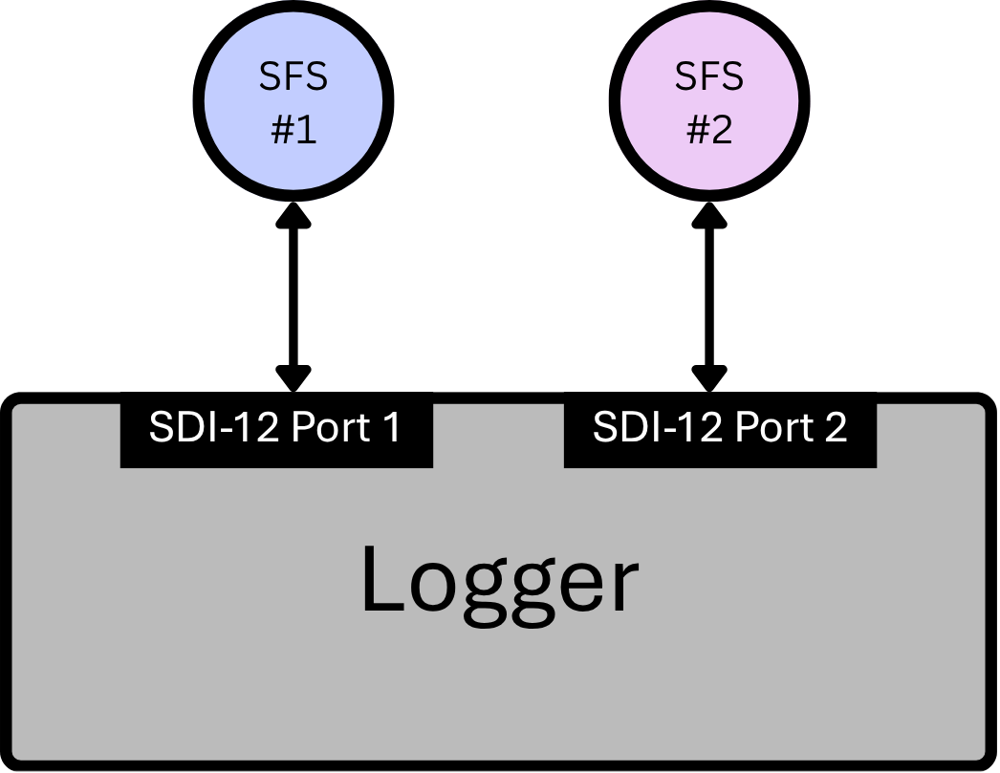

Figure 6: Sensor Logger Setup (for aM! command)

Note: Use the Measurement command when your sensor logger setup includes
two or more SDI‑12 ports, with each SFS connected to a separate SDI-12
ports. This command is especially helpful when:

• The logger cannot add delays between measurements, and

• The logger’s power is only active during measurement.

In these situations, the Measurement command ensures that every SFS on
each SDI‑12 port can take a reading and properly charge its
supercapacitor bank.

## Example 3: High Volume Measurement

The *0HA!* command is used to request a High‑Volume ASCII measurement
from the sensor at address 0. When this command is sent, the sensor
replies with a message such as 0143480, which indicates three key pieces
of information: the sensor’s address (0), the time remaining before the
full dataset is ready (143 seconds), and the total number of data points
that will be returned (480 values). These 480 values represent
temperature readings collected once per second across four thermistor
channels. The data are arranged in repeating groups of four, where each
second of logging produces values for Thermistor 1 OUT, Thermistor 1 IN,
Thermistor 2 OUT, and Thermistor 2 IN in that order. The index of each
value corresponds to the number of seconds that have passed since the
heat pulse. The full 143‑second measurement period reflects the complete
MHRM sequence, which includes 10 seconds of ADC initialisation, a
3‑second heat pulse, and 130 seconds of heat‑pulse logging and
processing. Once this sequence is complete, the full set of thermistor
data is ready for retrieval.

Figure 7: Raw Data

Note, a High-Volume raw data (aHA!) command will abort if it exceeds 143
seconds. Hence the supercapacitors must be fully charged before
initiating the command.

## Example 4: Multi‑Sensor Measurement Timing

# Maintenance and Support

## Serial Number Identification

## Firmware Upgrade

## Customer Repairs

## Diagnostic Commands

## Detailed Power Information

# Additional Information

## SFS Measurement Procedure: Standard HRM

## SFS Measurement Procedure: Raw Data

## Supercapacitor Bank

## Heater Power Management

###  Sensor to Logger Wiring configuration

Figure 8: Wiring
Configuration of SFS

| **Input/Output** | **Wire Colours** | **Comment**                     |
|------------------|------------------|---------------------------------|
| Power            | Red              | Voltage Range: **9-24V**        |
| Ground           | Black            |                                 |
| Data (SDI-12)    | White            |                                 |
| RS485 (A)        | Green            | Used for Firmware Upgrades Only |
| RS485 (B)        | Blue             |                                 |

Table 9: Product
Specifications

### 1.2 Serial Number Identification

Figure 9: Serial Number
Identification

### 1.3 Product Specifications

| **Voltage Input**                | 9-24 V                        |
|----------------------------------|-------------------------------|
| **Maximum Current at 12V**       | 50 mA                         |
| **Power Consumption**            | 2.635 Wh/day                  |
| **Minimum Measurement Interval** | 10 minutes (*recommended*)    |
| **Communication Interface**      | SDI-12                        |
| **Measurement Accuracy**         | 0.5 cm/hr                     |
| **Measurement Resolution**       | 0.01 cm/hr                    |
| **Enclosure Dimensions**         | 150 x 100 x 75 mm (L x W x H) |

Table 10: Basic SDI-12
Commands

### 1.4 Sensor Parameters

Figure 10: Sensor
Parameters

### 1.5 Interchangeable Heater and Thermistor Probes

The heater and thermistor probes are designed to be removable so the
sensor can be used on different plant species. The probes may be swapped
while the sensor is powered off, and no software changes are required.
An internal hardware circuit automatically provides the correct heating
energy for the installed heater needle, and the firmware identifies
which heater is connected. In Heat Ratio Method (HRM) measurements, the
heater needle code is returned as the 7th value, and the thermistor
needle diagnostic is returned as the 8th value. For faster checks, the
heater can be identified using the Trigger Heat Pulse command, and the
thermistor can be checked using the Raw Thermistor Data command.

Figure 11: Needle Types

*Note: ICT International offers three standard needle sets. Customers
can request custom thermistor positions by printing the HRM Needle
Design.pdf and aligning it with the desired sapwood profile.*

## SDI-12 COMMANDS

### 2.1 Basic SDI-12 Commands

<table>
<caption>
Table 11:
Extended SDI-12 Commands
</caption>
<colgroup>
<col style="width: 37%" />
<col style="width: 62%" />
</colgroup>
<thead>
<tr class="header">
<th>Command Name</th>
<th>Command</th>
</tr>
</thead>
<tbody>
<tr class="odd">
<td>Acknowledge Active</td>
<td>a!</td>
</tr>
<tr class="even">
<td>Send Identification</td>
<td>aI!</td>
</tr>
<tr class="odd">
<td>Change Address</td>
<td>aAb!</td>
</tr>
<tr class="even">
<td>Address Query</td>
<td>?!</td>
</tr>
<tr class="odd">
<td>Send Data</td>
<td>
aD0! (uncorrected outer and inner HPV)

aD1! (corrected outer and inner HPV)

aD2! (corrected outer and inner SapV)

aD3! (Heater and Thermistor Verification Code) 
aD4! (Temperature Diagnostics)
</td>
</tr>
<tr class="even">
<td rowspan="2">Start Measurement</td>
<td>
aM! (Measurement Command)

383 seconds
</td>
</tr>
<tr class="odd">
<td>
aC! (Concurrent Command)

156 seconds
</td>
</tr>
<tr class="even">
<td>Baseline Temperature</td>
<td>
aC1!

30 seconds average
</td>
</tr>
<tr class="odd">
<td>Trigger Heat Pulse</td>
<td>
aC2!

10 seconds
</td>
</tr>
<tr class="even">
<td>Raw Thermistor Data</td>
<td>
aC3!

10 seconds
</td>
</tr>
<tr class="odd">
<td>Supercapacitor Voltage</td>
<td>aC4!</td>
</tr>
<tr class="even">
<td>Heater Voltage</td>
<td>aC5!</td>
</tr>
<tr class="odd">
<td>Board Temperature</td>
<td>aC7!</td>
</tr>
</tbody>
</table>

Table 11: Extended SDI-12
Commands

### 2.2 Extended SDI-12 Commands

### 2.3 Heater Diagnostics Codes

| **Value** | **Shorthand**            | **Meaning**                                                              |
|-----------|--------------------------|--------------------------------------------------------------------------|
| -2        | Heater Needle Determined | This is the default code for a sensor that has not yet run a heat pulse. |
| -1        | Determination Error      | Caused by an inability to detect a stable heat pulse.                    |
| 0         | Needle Short Error       | A possible short has occurred or needle resistance is very low.          |
| 1         | 35mm Heater Detected     | The 18 ohm, 35mm heater needle has been detected.                        |
| 2         | 12mm Heater Detected     | The 8 ohm, 12 mm heater needle has been detected.                        |
| 3         | 22.5mm Heater Detected   | The 13 ohm 25.3mm heater needle has been detected.                       |
| 4         | Open Circuit Error       | Likely no needle attached / poor connection made. Reconnect needle.      |

Table 12: Heater
Diagnostics Code

### 2.4 Thermistor Diagnostics Codes

| **Value** | **Meaning**                                                                 | **Suggested Action**                                                                      |
|-----------|-----------------------------------------------------------------------------|-------------------------------------------------------------------------------------------|
| -1        | Thermistors undetermined                                                    | This is the default code for a sensor that has not yet run measurement that uses the ADC. |
| 0         | All Thermistors valid                                                       | None                                                                                      |
| 1         | Downstream probe partially disconnected or broken.                          | Reconnect the downstream thermistor probe.                                                |
| 2         | Downstream probe partially disconnected or broken.                          | Reconnect the downstream thermistor probe.                                                |
| 3         | Downstream probe fully disconnected or broken.                              | Reconnect the downstream thermistor probe.                                                |
| 4         | Upstream probe partially disconnected or broken.                            | Reconnect the upstream thermistor probe.                                                  |
| 5         | Upstream and downstream probes partially disconnected or broken.            | Reconnect both thermistor probes.                                                         |
| 6         | Upstream and downstream probes partially disconnected or broken.            | Reconnect both thermistor probes.                                                         |
| 7         | Downstream probe fully and upstream probe partially disconnected or broken. | Reconnect both thermistor probes.                                                         |
| 8         | Upstream probe partially disconnected or broken.                            | Reconnect the upstream thermistor probe.                                                  |
| 9         | Upstream and downstream probes partially disconnected or broken.            | Reconnect both thermistor probes.                                                         |
| 10        | Upstream and downstream probes partially disconnected or broken.            | Reconnect both thermistor probes.                                                         |
| 11        | Downstream probe fully and upstream probe partially disconnected or broken. | Reconnect both thermistor probes.                                                         |
| 12        | Upstream probe fully disconnected or broken.                                | Reconnect the upstream thermistor probe.                                                  |
| 13        | Upstream probe fully and downstream probe partially disconnected or broken. | Reconnect both thermistor probes.                                                         |
| 14        | Upstream probe fully and downstream probe partially disconnected or broken. | Reconnect both thermistor probes.                                                         |
| 15        | Upstream and downstream probes fully disconnected or broken.                | Reconnect both thermistor probes.                                                         |

Table 13: Thermistor
Diagnostics Codes

### 2.5 Temperature Rise Diagnostics Codes

| **Value** | **Meaning**                       |
|-----------|-----------------------------------|
| 0         | Temperature Rise OK               |
| 1         | TDIN ERROR                        |
| 2         | TDOUT ERROR                       |
| 3         | TDIN + TDOUT ERROR                |
| 4         | TUIN ERROR                        |
| 5         | TUIN +TDIN ERROR                  |
| 6         | TUIN + TUOUT ERROR                |
| 7         | TUIN + TDIN + TDOUT ERROR         |
| 8         | TUOUT ERROR                       |
| 9         | TUOUT + TDIN ERROR                |
| 10        | TUOUT + TDOUT ERROR               |
| 11        | TUOUT + TDIN + TDOUT ERROR        |
| 12        | TUOUT + TUIN ERROR                |
| 13        | TUOUT + TUIN + TDIN ERROR         |
| 14        | TUOUT + TUIN + TDOUT ERROR        |
| 15        | TUOUT + TUIN + TDIN + TDOUT ERROR |

Table 14: Temperature
Rise Diagnostics Codes

## POWER

### 3.1 SFS Power States

| Power States | Current Drawn (at 12V) |
|--------------|------------------------|
| Charging     | 50 mA                  |
| Active       | ~ 4 mA                 |
| Sleeping     | ~ 2 mA                 |

Table 15: SFS Power
States

> The Sap Flow Sensor (SFS) requires continuous power from the logger to
> operate correctly. Configure the logger so that the sensor always
> remains powered, even when the logger enters low‑power modes.

<table>
<caption>
Table 16: SFS
States
</caption>
<colgroup>
<col style="width: 16%" />
<col style="width: 83%" />
</colgroup>
<thead>
<tr class="header">
<th><strong>SFS States</strong></th>
<th>
<strong>Description</strong>

<em><strong>(10-minute Measurement Cycle)</strong></em>
</th>
</tr>
</thead>
<tbody>
<tr class="odd">
<td>Active</td>
<td>
<em>ADC Initialization &amp; Baseline Temperature Measurements
(1–42 seconds)</em>

The sensor powers up its ADC, stabilizes internal electronics, and
records baseline temperature values used for HRM calculations.
</td>
</tr>
<tr class="even">
<td>Charging</td>
<td>
<em>Supercapacitor Check &amp; Top‑Up (43–45 seconds)</em>

The system checks the supercapacitor voltage and adds a small top‑up
charge if required. This ensures the capacitor has enough stored energy
for the upcoming measurement phase.
</td>
</tr>
<tr class="odd">
<td>Active</td>
<td>
<em>Measurement, Processing &amp; HRM Calculation (46–156
seconds)</em>

The sensor performs the full Heat Ratio Method measurement, processes
raw thermal data, and calculates sap flow outputs. This is the
highest‑power phase of the cycle.
</td>
</tr>
<tr class="even">
<td>Charging</td>
<td>
<em>Supercapacitor Charging Cycle (157–236 seconds)</em>

The supercapacitor is fully recharged from the SDI‑12 supply. This
prepares the sensor for the next measurement cycle and prevents SDI‑12
current overload.
</td>
</tr>
<tr class="odd">
<td>Sleeping</td>
<td>
<em>Sleep (237–600 seconds)</em>

The sensor enters deep sleep, drawing minimal current. Only essential
circuitry remains active until the next cycle begins.
</td>
</tr>
</tbody>
</table>

Table 16: SFS States

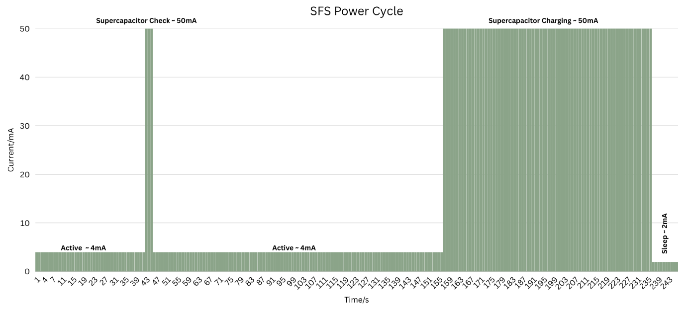Figure 12: SFS Power Cycle
Graph

### 3.2 SFS Power Consumption

<table>
<caption>
Table 17: SFS
Power Consumption at 12V input
</caption>
<colgroup>
<col style="width: 15%" />
<col style="width: 12%" />
<col style="width: 22%" />
<col style="width: 12%" />
<col style="width: 22%" />
<col style="width: 14%" />
</colgroup>
<thead>
<tr class="header">
<th>
<strong>Power</strong>

<strong>States</strong>
</th>
<th>Active</th>
<th>
Supercapacitor

Check
</th>
<th>Active</th>
<th>
Supercapacitor

Charging
</th>
<th>Sleep</th>
</tr>
</thead>
<tbody>
<tr class="odd">
<td><strong>Time (s)</strong></td>
<td>1-42</td>
<td>43-45</td>
<td>46-156</td>
<td>157-236</td>
<td>237-600</td>
</tr>
<tr class="even">
<td>Q1</td>
<td>0.0467</td>
<td></td>
<td></td>
<td></td>
<td></td>
</tr>
<tr class="odd">
<td>Q2</td>
<td></td>
<td>0.0417</td>
<td></td>
<td></td>
<td></td>
</tr>
<tr class="even">
<td>Q3</td>
<td></td>
<td></td>
<td>0.1233</td>
<td></td>
<td></td>
</tr>
<tr class="odd">
<td>Q4</td>
<td></td>
<td></td>
<td></td>
<td>1.1111</td>
<td></td>
</tr>
<tr class="even">
<td>Q5</td>
<td></td>
<td></td>
<td></td>
<td></td>
<td>0.2022</td>
</tr>
<tr class="odd">
<td><strong>QT</strong></td>
<td colspan="5">1.525 mAh for a 10-minute cycle at 12V</td>
</tr>
<tr class="even">
<td>
<strong>Power</strong>

<strong>(Wh/day)</strong>
</td>
<td colspan="5">2.635 Wh/day for a 10-minute cycle at 12V</td>
</tr>
</tbody>
</table>

Table 17: SFS Power
Consumption at 12V input

The current draw of the sensor differs depending on the input voltage
and device state. Empirically measured data on a SFS gave the following
results:

| **Input (V)** | **Current when charging supercapacitors (mA)** | **Current when sensor idle (mA)** | **Current when sensor asleep (mA)** |
|---------------|------------------------------------------------|-----------------------------------|-------------------------------------|
| 9             | 67.5                                           | 3.66                              | 1.84                                |
| 12            | 50                                             | 2.96                              | 1.57                                |
| 15            | 41                                             | 2.57                              | 1.40                                |
| 18            | 35                                             | 2.30                              | 1.30                                |
| 21            | 31                                             | 2.11                              | 1.22                                |
| 24            | 28                                             | 1.96                              | 1.15                                |

Table 18: SFS Current
Draw at different input voltages

With a 15-minute measurement interval, using a high-volume measurement
command, power consumption can be deduced for a 24hr duration.

| **Input (V)** | **Charging power per measurement (Wh)** | **Active power per measurement (Wh)** | **Sleep power per measurement (Wh)** | **Power per day (Wh)** |
|---------------|-----------------------------------------|---------------------------------------|--------------------------------------|------------------------|
| 9             | 0.0206                                  | 0.0014                                | 0.0029                               | 2.39                   |
| 12            | 0.0203                                  | 0.0015                                | 0.0033                               | 2.41                   |
| 15            | 0.0208                                  | 0.0016                                | 0.0036                               | 2.51                   |
| 18            | 0.0214                                  | 0.0018                                | 0.0041                               | 2.61                   |
| 21            | 0.0221                                  | 0.0019                                | 0.0044                               | 2.73                   |
| 24            | 0.0228                                  | 0.0020                                | 0.0048                               | 2.84                   |

Table 19: SFS Power Draw
for high volume command

## FIRMWARE UPGRADE

### 4.1 Firmware Upgrade over RS485

Figure 13: SFS Firmware
Update Process

For the SFS firmware update process the following tools are required:

1.  Industrial USB to RS485 Converter -
    <https://www.waveshare.com/product/usb-to-rs485.htm>

2.  DC Power Source 9-24V Rated

3.  ICT Sensor Firmware Updater v1.1.0 – provided by ICT International

4.  Latest Sap Flow Sensor Firmware (.sfs) file – provided by ICT
    International

> After wiring the sensor as shown in Figure 5.1, launch the ICT Sensor
> Firmware Updater on a Windows PC running Windows 10 or later.

1.  Click the “Select File” button on the software and open the latest
    firmware .sfs file from file explorer

> 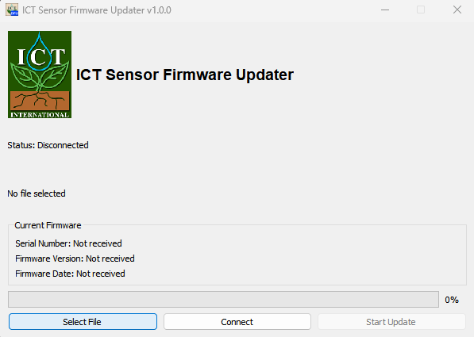 style="width:4.31429in;height:3.07042in" />

Figure 14: Select the
firmware file

2.  Click the “Connect” button on the software

>  style="width:4.47826in;height:3.22252in" />

Figure 15: Connect the
sensor

3.  Once connected the Current Firmware section of the software will
    populate with the current firmware version of the sensor, click
    “Start Update”

>  style="width:4.76087in;height:3.41747in" />

Figure 16: Start Update
process

4.  Once the “Status” of the software changes to “Done”, click
    “Disconnect”

> 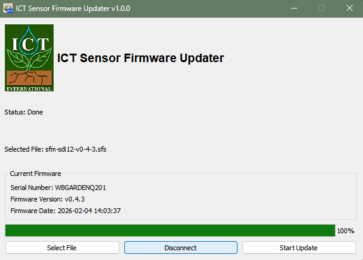 style="width:4.66304in;height:3.34401in" />

Figure 17: Disconnect the
sensor from the software

5.  Switch off the power supply before unplugging the sensor

## Appendix A

### SFS Measurement Procedure: Standard HRM

Figure 18: Standard HRM Measurement

Note, a Concurrent HRM command variant (e.g. aC!) will abort if it
exceeds 156 seconds. Hence the supercapacitors must be fully charged
before initiating the command. A Standard HRM command variant (e.g. aM!)
is 383 seconds to ensure that even a fully depleted supercapacitor bank
will charge before a measurement, and the measurement will complete.

### SFS Measurement Procedure: Raw Data 

Figure 19: Raw Data

Note, a High Volume raw data (aHA!) command will abort if it exceeds 143
seconds. Hence the supercapacitors must be fully charged before
initiating the command.

### SFS Power Modes: Notes 

| **Power Modes**          | **Important Notes**                                                                                                                                                                                                                                                                                                                                                                                                                                                                                                                                                                                                                                                                                                                |
|--------------------------|------------------------------------------------------------------------------------------------------------------------------------------------------------------------------------------------------------------------------------------------------------------------------------------------------------------------------------------------------------------------------------------------------------------------------------------------------------------------------------------------------------------------------------------------------------------------------------------------------------------------------------------------------------------------------------------------------------------------------------|
| Sleep                    | Bus must be powered                                                                                                                                                                                                                                                                                                                                                                                                                                                                                                                                                                                                                                                                                                                |
|                          | Occurs when no measurements are active                                                                                                                                                                                                                                                                                                                                                                                                                                                                                                                                                                                                                                                                                             |
| Active                   | While measurement is active and supercapacitors are not changing                                                                                                                                                                                                                                                                                                                                                                                                                                                                                                                                                                                                                                                                   |
| Charging Supercapacitors | Before HRM during 'M' command                                                                                                                                                                                                                                                                                                                                                                                                                                                                                                                                                                                                                                                                                                      |
|                          | During a HRM measurement ('C', 'M' or 'HA'), just after a baseline measurement and before a heat pulse there is a "top up" charge that will last until the supercapacitors have adequate charge for a heat pulse. Note, with a standard interval of 15 minutes between concurrent commands, this will be ~3 seconds. If the interval since the last concurrent command is larger, the bus has only just been powered or if the bus is not powered between measurements, this "top up" charge will be longer and as such, concurrent commands should not be used without script management of power. For simplicity, 'M' commands can be used to ensure that the bus is powered for an adequate time to charge the supercapacitors. |
|                          | Following a HRM measurement ('C', 'M' or 'HA')                                                                                                                                                                                                                                                                                                                                                                                                                                                                                                                                                                                                                                                                                     |

Table 20: SFS Power Modes

## Appendix C

### Enclosure Connector Layout

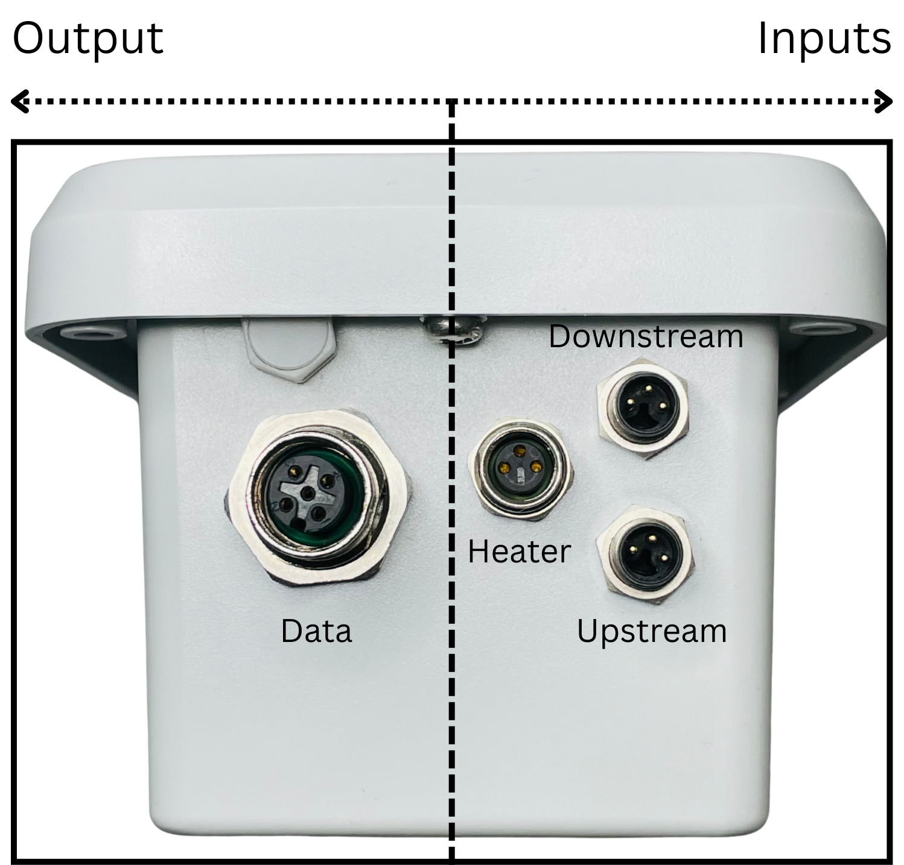

Figure 20: SFS Connector
Layout

This diagram shows where each cable connects on the Sap Flow Sensor
(SFS). The Data port on the left sends measurements out to the logger,
while the three ports on the right are inputs from the probe: Heater
(middle connector) powers the constant current heater, and Upstream and
Downstream (top and bottom connectors) connect to the two thermistor
probes inserted above and below the heater.

### Cable Connector Wiring

Figure 21: SFS Cable
Connector Wiring

### 1.6 Supercapacitor Bank

The supercapacitor bank is used to store energy for heat pulses. The
supercapacitors allow up to 6x SFS devices to be supported on the SDI-12
bus without special power considerations i.e. no need for complicated
software management of power or breaking of protocol power standards.
The supercapacitors nominally charge to 4.8V. They can be diagnosed with
a Supercapacitor Voltage command.

Figure 22: Needle Types

### 1.7 Traditional Sap Flow Meters (SFM1 and SFM1x)

> In traditional SFM and early SFM1x sensors, the heater always receives
> a fixed 12 V supply. Because voltage is constant, the current depends
> entirely on the heater’s resistance (Ohm’s Law).

- Standard heater (18 Ω): 0.67 A

- Corn heater (8 Ω): 1.5 A

- Vine heater (13 Ω): 0.92 A

> This means the corn heater draws 2.2 times, and the vine heater 1.4
> times, the current of the standard heater.
>
> Since Power = Voltage × Current, smaller‑resistance heaters generate
> much more heat per millimetre of needle length:

- Standard: 0.23 W/mm

- Corn: 1.50 W/mm

- Vine: 0.49 W/mm

> As needle size decreases, power per millimetre increases sharply,
> which can overheat and damage plant tissue. Hence, only standard 35mm
> heater is suitable for those instruments.

### 1.8 Constant Current Circuit Advantage

> In the updated design for SFS, all heater types are driven with a
> constant current of 0.67 A. The voltage automatically adjusts based on
> heater resistance:

- Standard (18 Ω): 12.06 V

- Corn (8 Ω): 5.36 V

- Vine (13 Ω): 8.71 V

> This results in much more consistent power per millimetre across all
> heater types:

- Standard: 0.231 W/mm

- Corn: 0.299 W/mm

- Vine: 0.259 W/mm

> Because all heaters share the same needle body, heat is also
> dissipated through the plastic housing, making the actual power/mm
> even more uniform.

Figure 23: Heater Power
Management
